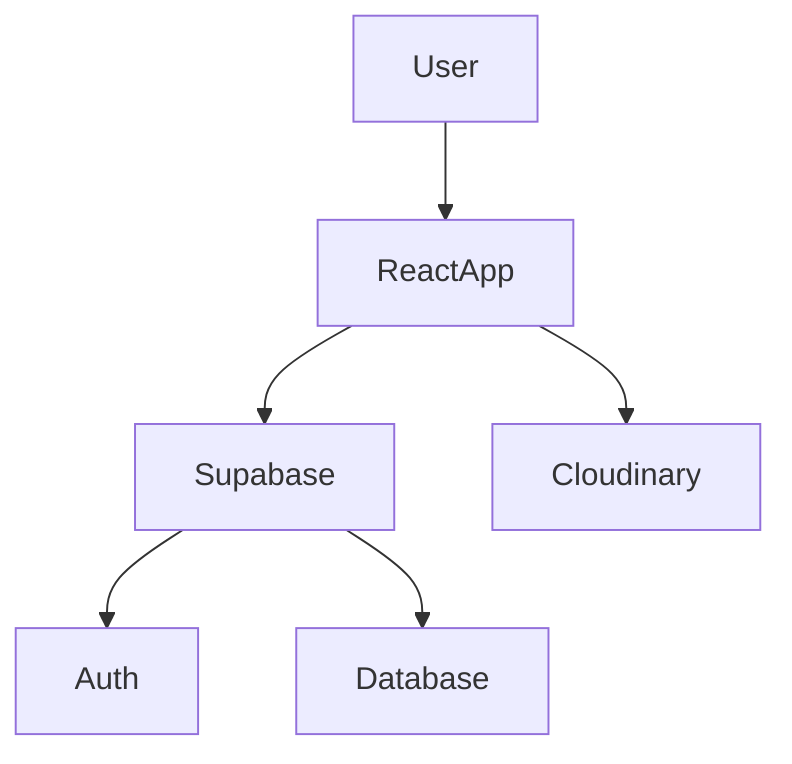
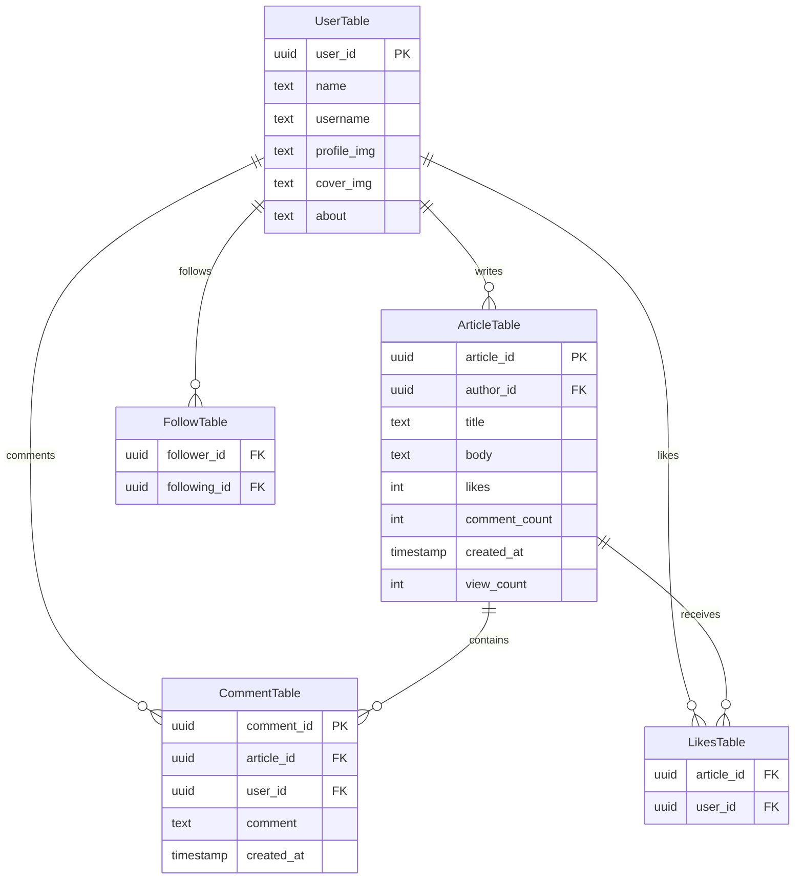

Welcome to **Lexis** — a modern blogging platform where writing feels fast, reading feels social, and the app can live on your home screen like a real installable product 📲✨

With Lexis you can:
- Write rich articles (Tiptap) 
- Discover posts via feeds + search 
- Like, comment, and follow authors
- Build your profile + vibe 
- Install as an app 
- Toggle light/dark themes

<b> 🌐 Live Demo : </b>

[Lexis Live](lexis-steel.vercel.app/home)

---

## Features ✨

- Rich text article editor
- Authentication system
- Follow/unfollow users
- Article engagement system
- Dark/light theme
- PWA support
- Responsive UI


## Tech Stack 💻

- React 19 + React Router
- Vite  + Vite PWA
- Tailwind CSS v4
- Supabase
- Cloudinary
- Tiptap 


---


## Running Lexis Locally 🚀


Follow these steps to set up and run the project on your local machine.


### 📋 1. Prerequisites

Make sure the following are installed and configured before starting:

* Node.js and npm
* A Supabase project

  * Supabase Project URL
  * Supabase Anon/Public Key
* A Cloudinary account

  * Cloud Name
  * Upload Preset


### 📦 2. Install Dependencies
Install all required packages:

```bash
npm install
```


### 🔐 3. Configure Environment Variables
Create a `.env` file in the project root directory and add the following variables:

```env
VITE_SUPABASE_URL=your_supabase_url
VITE_SUPABASE_PUBLISHABLE_DEFAULT_KEY=your_supabase_anon_key

VITE_CLOUDINARY_CLOUD_NAME=your_cloudinary_cloud_name
VITE_CLOUDINARY_UPLOAD_PRESET=your_upload_preset
```

##### 🧠 Notes

* `VITE_SUPABASE_PUBLISHABLE_DEFAULT_KEY` refers to the **Supabase anon/public key** used on the client side.
* All environment variables must start with the `VITE_` prefix to be exposed by Vite.


 ### 🖼️  4. Cloudinary Setup 

Lexis uploads images to Cloudinary using:
- `VITE_CLOUDINARY_CLOUD_NAME`
- `VITE_CLOUDINARY_UPLOAD_PRESET`

Make sure your **upload preset** supports the upload mode you’re using (often unsigned) and the resource types you need ✅
 
 
  ###  📲 5. PWA (Progressive Web App)

Lexis is PWA-enabled via `vite-plugin-pwa` and configured with `autoUpdate`.

- Manifest settings live in `vite.config.js` 🧩
- For the most realistic PWA behavior locally, use:


Installability depends on browser rules (localhost is usually OK) 🌍


### ▶️ 6. Start the Development Server

Run the following command:

```bash
npm run dev
```

After the server starts, Vite will display a local development URL in the terminal.

Open that URL in your browser  to access the application.


---


## Usage 🧵


### If you’re here to read 📖
- Browse timelines + home feed 
- Search for articles 
- Like and comment 
- Follow people and keep up with them 

### If you’re here to write ✍️
- Publish with a rich-text editor 
- Add images 
- Track engagement


## Project structure 📂


```
src/
  components/    UI + feature components
  context/       React contexts for user/data/theme
  config/        Supabase client
  utils/         Helpers
  assets/        Static assets
```

---


## Lexis Architecture 🗾

<br/>

---

## Supabase Database Schema 🗄️ 

Lexis uses Supabase for:

* 🔐 Authentication (Email/Password + Google OAuth)
* 💾 Database storage
* 👤 User management

---

### 🛠️ Database Setup

Go to your **Supabase Dashboard → SQL Editor** and run the following SQL to create all required tables:

```sql
-- Enable UUID generation
CREATE EXTENSION IF NOT EXISTS "pgcrypto";

-- =========================
-- UserTable
-- =========================
CREATE TABLE "UserTable" (
  user_id uuid PRIMARY KEY DEFAULT gen_random_uuid(),
  name text,
  username text UNIQUE,
  profile_img text,
  cover_img text,
  about text
);

-- =========================
-- ArticleTable
-- =========================
CREATE TABLE "ArticleTable" (
  article_id uuid PRIMARY KEY DEFAULT gen_random_uuid(),
  author_id uuid REFERENCES "UserTable"(user_id) ON DELETE CASCADE,
  title text,
  body text,
  likes integer DEFAULT 0,
  comment_count integer DEFAULT 0,
  created_at timestamptz DEFAULT now(),
  view_count integer DEFAULT 0,
  images text[]
);

-- =========================
-- CommentTable
-- =========================
CREATE TABLE "CommentTable" (
  comment_id uuid PRIMARY KEY DEFAULT gen_random_uuid(),
  article_id uuid REFERENCES "ArticleTable"(article_id) ON DELETE CASCADE,
  user_id uuid REFERENCES "UserTable"(user_id) ON DELETE CASCADE,
  comment text,
  created_at timestamptz DEFAULT now()
);

-- =========================
-- LikesTable
-- =========================
CREATE TABLE "LikesTable" (
  article_id uuid REFERENCES "ArticleTable"(article_id) ON DELETE CASCADE,
  user_id uuid REFERENCES "UserTable"(user_id) ON DELETE CASCADE,
  UNIQUE(article_id, user_id)
);

-- =========================
-- FollowTable
-- =========================
CREATE TABLE "FollowTable" (
  follower_id uuid REFERENCES "UserTable"(user_id) ON DELETE CASCADE,
  following_id uuid REFERENCES "UserTable"(user_id) ON DELETE CASCADE,
  UNIQUE(follower_id, following_id)
);
```

---

### 🔒 Row Level Security (RLS) Policies

Supabase enables RLS by default. You **must** add these policies, otherwise all database operations will be blocked with a `403 Forbidden` error.

Run this in the **SQL Editor** after creating the tables:

```sql
-- =========================
-- Enable RLS on all tables
-- =========================
ALTER TABLE "UserTable" ENABLE ROW LEVEL SECURITY;
ALTER TABLE "ArticleTable" ENABLE ROW LEVEL SECURITY;
ALTER TABLE "CommentTable" ENABLE ROW LEVEL SECURITY;
ALTER TABLE "LikesTable" ENABLE ROW LEVEL SECURITY;
ALTER TABLE "FollowTable" ENABLE ROW LEVEL SECURITY;

-- =========================
-- UserTable Policies
-- =========================
CREATE POLICY "Anyone can view users"
  ON "UserTable" FOR SELECT
  USING (true);

CREATE POLICY "Users can create own profile"
  ON "UserTable" FOR INSERT
  TO authenticated
  WITH CHECK (user_id = auth.uid());

CREATE POLICY "Users can update own profile"
  ON "UserTable" FOR UPDATE
  TO authenticated
  USING (user_id = auth.uid());

-- =========================
-- ArticleTable Policies
-- =========================
CREATE POLICY "Anyone can view articles"
  ON "ArticleTable" FOR SELECT
  USING (true);

CREATE POLICY "Users can create articles"
  ON "ArticleTable" FOR INSERT
  TO authenticated
  WITH CHECK (author_id = auth.uid());

CREATE POLICY "Users can update own articles"
  ON "ArticleTable" FOR UPDATE
  TO authenticated
  USING (author_id = auth.uid());

CREATE POLICY "Users can delete own articles"
  ON "ArticleTable" FOR DELETE
  TO authenticated
  USING (author_id = auth.uid());

-- =========================
-- CommentTable Policies
-- =========================
CREATE POLICY "Anyone can view comments"
  ON "CommentTable" FOR SELECT
  USING (true);

CREATE POLICY "Users can create comments"
  ON "CommentTable" FOR INSERT
  TO authenticated
  WITH CHECK (user_id = auth.uid());

CREATE POLICY "Users can delete own comments"
  ON "CommentTable" FOR DELETE
  TO authenticated
  USING (user_id = auth.uid());

-- =========================
-- LikesTable Policies
-- =========================
CREATE POLICY "Anyone can view likes"
  ON "LikesTable" FOR SELECT
  USING (true);

CREATE POLICY "Users can like"
  ON "LikesTable" FOR INSERT
  TO authenticated
  WITH CHECK (user_id = auth.uid());

CREATE POLICY "Users can unlike"
  ON "LikesTable" FOR DELETE
  TO authenticated
  USING (user_id = auth.uid());

-- =========================
-- FollowTable Policies
-- =========================
CREATE POLICY "Anyone can view follows"
  ON "FollowTable" FOR SELECT
  USING (true);

CREATE POLICY "Users can follow"
  ON "FollowTable" FOR INSERT
  TO authenticated
  WITH CHECK (follower_id = auth.uid());

CREATE POLICY "Users can unfollow"
  ON "FollowTable" FOR DELETE
  TO authenticated
  USING (follower_id = auth.uid());
```

---

### 🔑 Authentication Setup

Lexis supports **Email/Password** and **Google OAuth** login.

#### Email/Password
Enabled by default in Supabase. No extra configuration needed.

#### Google OAuth

1. **Google Cloud Console:**
   - Go to [Google Cloud Console](https://console.cloud.google.com/) → **APIs & Services** → **Credentials**
   - Create an **OAuth 2.0 Client ID** (Web application)
   - Add `https://<your-supabase-project>.supabase.co/auth/v1/callback` to **Authorized redirect URIs**
   - Copy the **Client ID** and **Client Secret**

2. **Supabase Dashboard:**
   - Go to **Authentication** → **Providers** → **Google**
   - Enable the Google provider
   - Paste the **Client ID** and **Client Secret** from Google Cloud Console

3. **Redirect URLs:**
   - Go to **Authentication** → **URL Configuration**
   - Add your app URLs to **Redirect URLs**:
     - `http://localhost:5173` (for local development)
     - Your production URL (e.g., `https://lexis.vercel.app`)

---

### 📋 Required Tables

#### 👤 `UserTable`

Stores user profile information.

| Column        | Type   | Description            |
| ------------- | ------ | ---------------------- |
| `user_id`     | uuid   | Primary key            |
| `name`        | text   | Display name           |
| `username`    | text   | Public username (unique)|
| `profile_img` | text   | Profile image URL      |
| `cover_img`   | text   | Cover/banner image URL |
| `about`       | text   | User bio/about section |

---

#### 📝 `ArticleTable`

Stores articles/posts created by users.

| Column          | Type        | Description               |
| --------------- | ----------- | ------------------------- |
| `article_id`    | uuid        | Primary key               |
| `author_id`     | uuid (FK)   | Reference to the author   |
| `title`         | text        | Article title             |
| `body`          | text        | Article content           |
| `likes`         | integer     | Total likes count         |
| `comment_count` | integer     | Total comments count      |
| `created_at`    | timestamptz | Creation timestamp        |
| `view_count`    | integer     | Number of views           |
| `images`        | text[]      | Attached image URLs       |

---

#### 💬 `CommentTable`

Stores comments on articles.

| Column       | Type        | Description               |
| ------------ | ----------- | ------------------------- |
| `comment_id` | uuid        | Primary key               |
| `article_id` | uuid (FK)   | Related article           |
| `user_id`    | uuid (FK)   | Comment author            |
| `comment`    | text        | Comment text              |
| `created_at` | timestamptz | Creation timestamp        |

---

#### ❤️ `LikesTable`

Tracks which users liked which articles.

| Column       | Type      | Description                |
| ------------ | --------- | -------------------------- |
| `article_id` | uuid (FK) | Liked article              |
| `user_id`    | uuid (FK) | User who liked the article |

> Unique constraint on `(article_id, user_id)`

---

#### 👥 `FollowTable`

Stores user follow relationships.

| Column         | Type      | Description         |
| -------------- | --------- | ------------------- |
| `follower_id`  | uuid (FK) | User who follows    |
| `following_id` | uuid (FK) | User being followed |

> Unique constraint on `(follower_id, following_id)`

---

### 🔗 Database Relationships



---


## Future Improvements 🏗️


---


